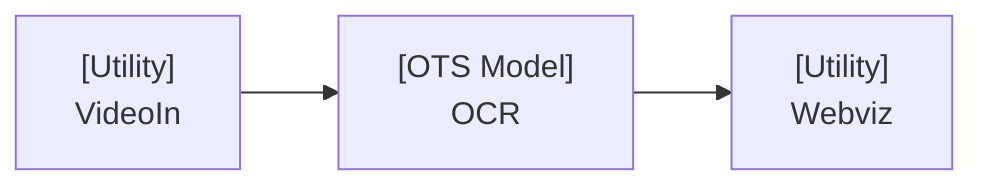

# Hello World OCR Demo

## Table of Contents
- [Hello World OCR Demo](#hello-world-ocr-demo)
  - [Overview](#overview)
  - [Requirements](#requirements)
  - [Notes before running](#notes-before-running)
  - [Running the demo](#running-the-demo) 
    - [Steps](#steps)
  - [Running the demo pipelines](#running-the-demo-pipelines) 
    - [Steps for minimal pipelines](#steps-for-minimal-pipelines)   
  - [Testing](#testing)
  - [Mini Test plan](#mini-test-plan)
    - [Scope](#scope)
    - [Flows to be tested](#flows-to-be-tested)
    - [Flows that won't be tested](#flows-that-wont-be-tested)
    - [Testing Assumptions](#testing-assumptions)

## Overview

This example demonstrates several filter types easily composed together to achieve a simple task: run OCR on a simple text video



This example demonstrates 3 filters composed together to achieve our **hello world ocr demo** goal:

* **VideoIn**
  A **Utility** filter (does not run any models) which takes in an RTSP feed or a video file and pushes the frames forward through the pipeline.

* **OCR Filter**
  An **Off-the-Shelf (OTS) Model** filter that processes the frames passed to it by video in and applies optical character recognition (OCR) to extract the text.

* **Webviz Filter**
  A **Utility** filter which displays the frames passed to it on a live feed in the browser

## Requirements
- Linux system
- [Python 3.11](https://www.python.org/downloads/release/python-3110/)

## Notes before running
> Note: This project is designed with Linux support in mind. It should run on macOS, but your mileage may vary.

## Running the demo

### Steps
1. [Optional] Create a virtual environment using a tool of your choosing (`venv` is used here)
```
python -m venv venv
source venv/bin/activate
```
2. run `make install`
3. run `make run`
4. visit `http://localhost:8000`

`make run` executes the filter pipeline via the openfilter CLI as follows:

```bash
openfilter run \
	- VideoIn \
		--sources 'file://hello.mov!loop' \
	- filter_optical_character_recognition.filter.FilterOpticalCharacterRecognition \
		--ocr_engine easyocr \
		--forward_ocr_texts true \
	- Webvis
```

#### Alternatively, you may use the `Filter.run_multi` utility as follows:
```bash
python filter_hello_ocr/main.py
```

We encourage the inspect the content of [filter_hello_ocr/main.py](filter_hello_ocr/main.py) for a code example!

## Running the demo pipelines

The demo pipelines can be run using the makefile command (make run_cli) or python command (python filter_hello_ocr/main_minimal_script.py).
Basically they are a execution without the loop, so they will run once and exit. 

### Steps for minimal pipelines
1. [Optional] Create a virtual environment using a tool of your choosing (`venv` is used here)
```
python -m venv venv
source venv/bin/activate
```
2. run `make install`
3. run `make run_cli`
4. visit `http://localhost:8000`

`make run_cli` executes the filter pipeline via the openfilter CLI as follows:

```bash
openfilter run \
	- VideoIn \
		--sources 'file://hello.mov' \
	- filter_optical_character_recognition.filter.FilterOpticalCharacterRecognition \
		--ocr_engine easyocr \
		--forward_ocr_texts true \
	- Webvis
```

#### Alternatively, you may use the `Filter.run_multi` utility as follows:
```bash
python filter_hello_ocr/main_minimal_script.py
```

## Mini Test plan

The objective is to give an overall vision of what it's gonna be tested.

### Scope

- hello-ocr filters: VideoIn, FilterOpticalCharacterRecognition, and VideoOut

### Flows to be tested

- VideoIn filter
- FilterOpticalCharacterRecognition filter
- VideoOut filter

### Flows that won't be tested

- All the filters, except the ones mentioned above

### Testing Assumptions

- Linux environment
- [Requirements](#requirements) installed
- Validate input video file such as [hello.mov](hello.mov)
- Web browser to visualize the video. For example: Firefox or Chrome.

## Testing

Run tests locally:
```bash
make test
```

Or run a specific test file:

```bash
pytest -v tests/test_filter_ocr.py
```

Tests cover:

* Each filter used inside the hello-ocr filter example: VideoIn, FilterOpticalCharacterRecognition, and VideoOut
* All the filters connected
* OCR can be extract the right text
* Filter output delivered

## Inspecting Output, and Metrics